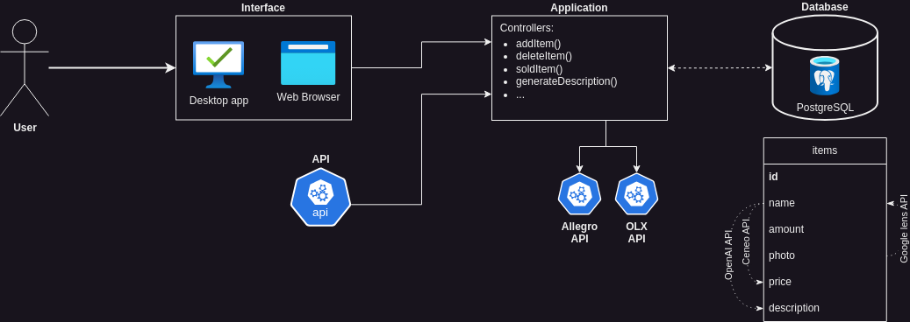

# Autoseller

## Co to jest?
Program Autoseller służy do zautomatyzowania sprzedaży na platformach takich jak Allegro czy OLX.

## Instalacja

## Licencja
Nasz kod jest dystrybuowany na licencji [GNU General Public License](LICENSE).

## Autorzy
- Krzysztof Pacyna
- Mateusz Rój
- Albert Piskorz
- Mateusz Popielarz